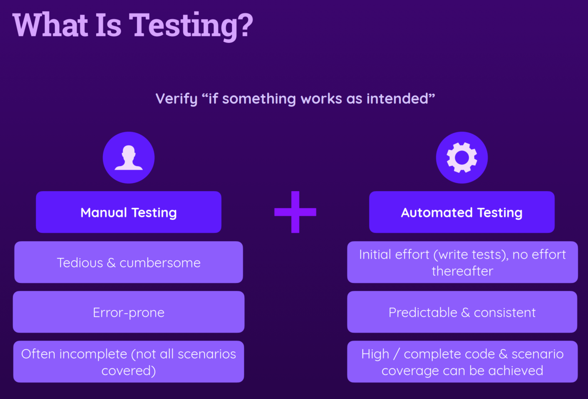
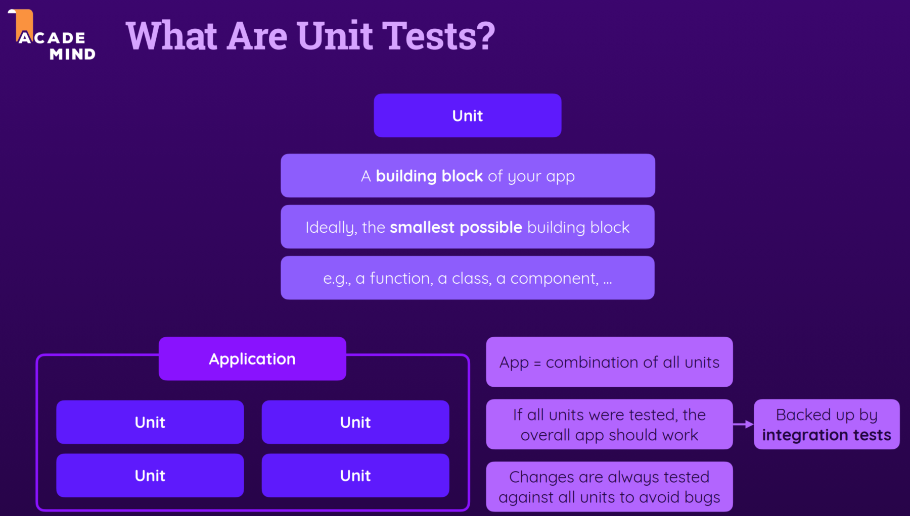
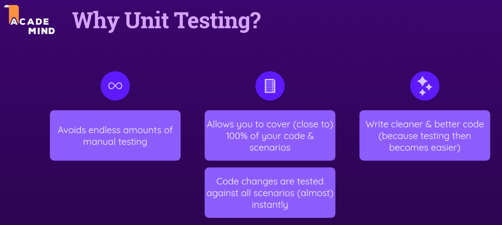
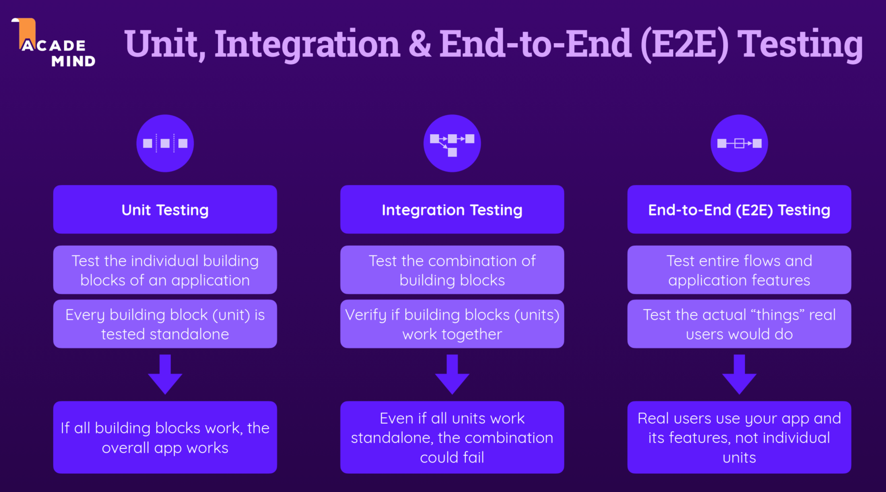
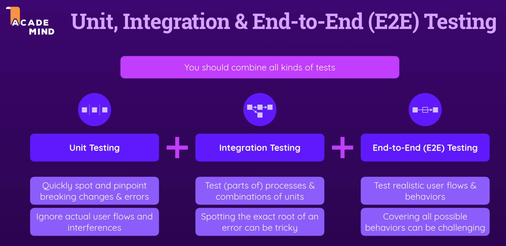
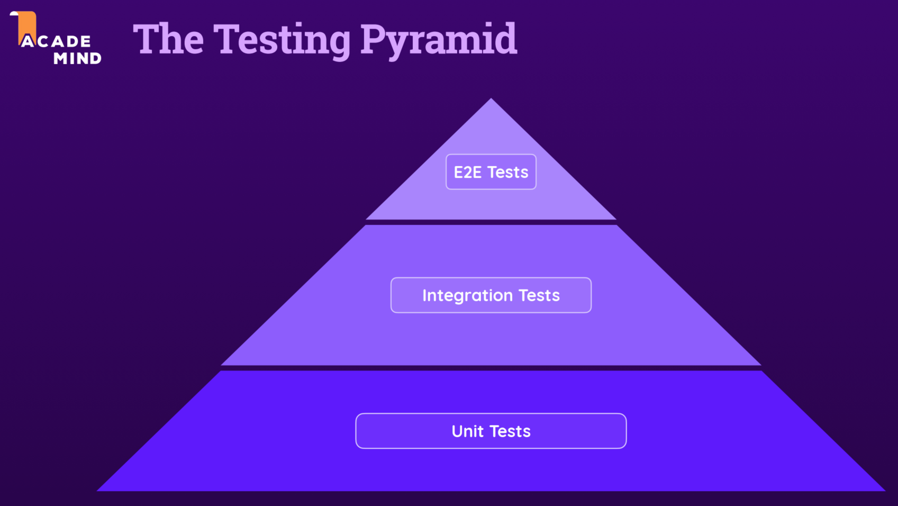
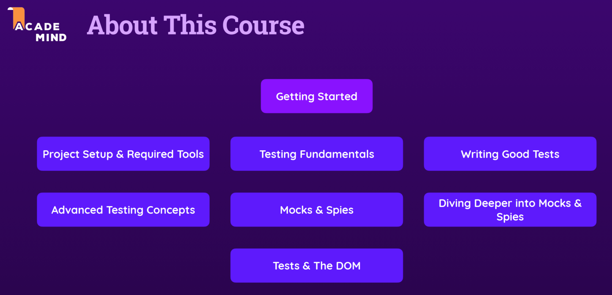

# Getting Started

- [Getting Started](#getting-started)
  - [What is Testing?](#what-is-testing)
  - [What are unit Testing](#what-are-unit-testing)
  - [Why Test](#why-test)
  - [Unit,Integration & End-to-End Testing](#unitintegration--end-to-end-testing)
  - [Test Pyramid](#test-pyramid)
  - [About This Course](#about-this-course)

## What is Testing?

## What are unit Testing

## Why Test

## Unit,Integration & End-to-End Testing

## Test Pyramid

## About This Course

