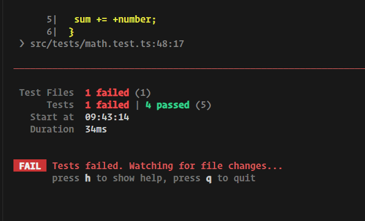

# Setup & Testing Software

## Which Tools Are Needed For Testing

we are going to use vitest

- [vitest website](https://vitest.dev/)

## Jest & Vitest

## Installing Vitest

## Course Project Setup

