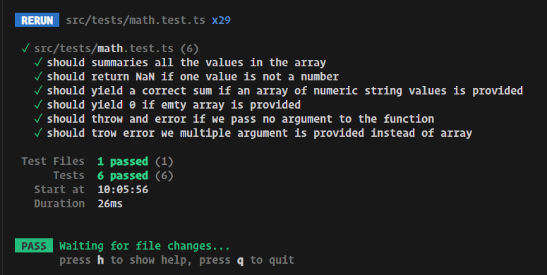
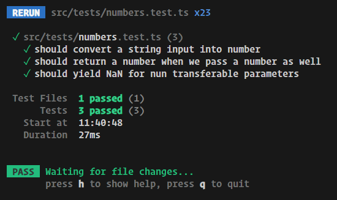
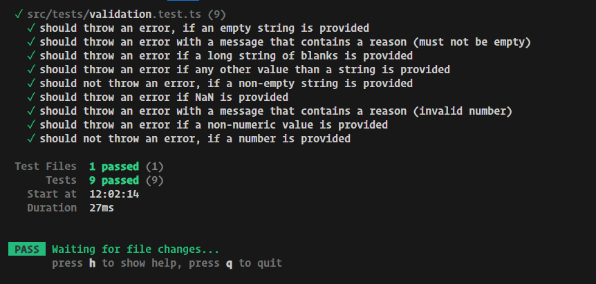
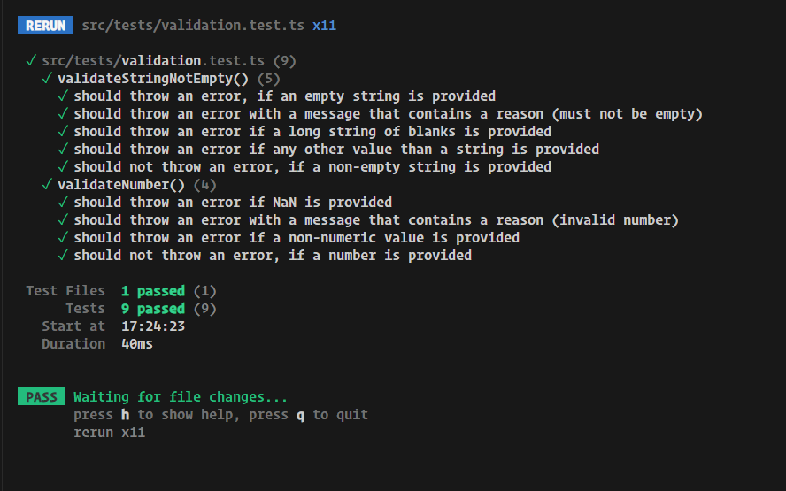

# Testing Basics

in your vite app install vitest

## let's add the vitest

```shell
npm install -D vitest
```

## let's add the command to run the vitest


## let's create a math file

```ts
export function add(numbers: number[]) {
 let sum = 0;

 for (const number of numbers) {
  sum += number;
 }
 return sum;
}

```

let's write the test cases for the math add function

```ts
import { it, expect } from 'vitest';
import { add } from './math';
// we can use test ot it
// they are both similar
// it('what your are testing and what is your expectation');
// this should be short and concise

it('should summaries all the values in the array', () => {
 const result = add([1, 2, 3]);
 expect(result).to.toBe(6);
});

```

and run the npm test command


## writing good tests the AAA pattern


let's add the method into our app

```ts
import { it, expect } from 'vitest';
import { add } from './math';
// we can use test ot it
// they are both similar
// it('what your are testing and what is your expectation');
// this should be short and concise

it('should summaries all the values in the array', () => {
 // Arrange
 const numbers = [1, 2, 3];
 const expectedResult = numbers.reduce((previousValue, currentValue) => {
  return previousValue + currentValue;
 }, 0);
 // Act
 const result = add(numbers);
 // Assert
 expect(result).to.toBe(expectedResult);
});
```

## Defining Behaviors & Fixing Errors In Your Code

let's add more tests to our add function

```ts
it('should return NaN if one value is not a number', () => {
 const inputs = [1, 2, 'not a number'];

 const result = add(inputs);

 expect(result).toBeNaN();
});

it('should yield a correct sum if an array of numeric string values is provided', () => {
 const inputs = ['1', '2'];
 const expectedResult = inputs.reduce((previousValue, currentValue) => {
  return +previousValue + +currentValue;
 }, 0);

 const result = add(inputs);

 expect(result).toBe(expectedResult);
});

```

now we can see our method doesn't work the way we want.


so let's fix our code


now our test are passing


## 9. Demo Writing More Tests

- writing test is a iterative process.
- when we are writing code we will think of writing new test cases for our code.
- when we have more understanding about our code we can write more meaning fool tests.
- there is no wright or wrong answers when it comes to tests.
- we should all ways be open to add or remove tests

let's add more tests

```ts
it('should yield 0 if emty array is provided', () => {
 const inputs = [];

 const result = add(inputs);

 expect(result).toBe(0);
});

it('should throw and error if we pass no argument to the function', () => {
 const result = add();
});
```


## Testing For Errors

let's fix the issue

```ts
it('should throw and error if we pass no argument to the function', () => {
 const resultFn = () => {
  add();
 };

 expect(resultFn).toThrow();
 // by using not in any test we can check for opposite
 // expect(resultFn).not.toThrow();
});

```


## Demo Adding More Tests

```ts
it('should trow error we multiple argument is provided instead of array', () => {
 const num1 = 1;
 const num2 = 3;

 const resultFn = () => add(num1, num2);

 expect(resultFn).toThrow();
});

```


## Testing For Thrown Errors & Error Messages

```ts
it('should trow error we multiple argument is provided instead of array', () => {
 const num1 = 1;
 const num2 = 3;

 const resultFn = () => add(num1, num2);
 // here we can add a regular expression to find the correct error message
 expect(resultFn).toThrow(/numbers is not iterable/);
});
```



## Exercise Problem

let's write tests for the function

```ts
export function transformToNumber(value: string | number) {
 return +value;
}
```

## Exercise Solution

```ts
import { expect, it } from 'vitest';
import { transformToNumber } from './numbers';
it('should convert a string input into number', () => {
 const input = '12';
 const expectedResult = +input;

 const result = transformToNumber(input);

 expect(result).toBe(expectedResult);
 expect(result).toBeTypeOf('number');
});

it('should return a number when we pass a number as well', () => {
 const input = 12;
 const expectedResult = input;

 const result = transformToNumber(input);

 expect(result).toBe(expectedResult);
});

it('should yield NaN for nun transferable parameters', () => {
 const input = 'invalid';

 const result = transformToNumber(input);
 expect(result).toBeNaN();
});

```



## Tests With Multiple Assertions (Multiple Expectations)

```ts
it('should yield NaN for nun transferable parameters', () => {
 const input = 'invalid';
 const input2 = {};
 const result = transformToNumber(input);
 const result2 = transformToNumber(input2);
 expect(result).toBeNaN();
 expect(result2).toBeNaN();
});
```

here when we are using typescript we will get an error when we try to pass wrong parameter type

## More Practice

```ts
export function validateStringNotEmpty(value: string) {
 if (value.trim().length === 0) {
  throw new Error('Invalid input - must not be empty.');
 }
}

export function validateNumber(number: number) {
 if (isNaN(number) || typeof number !== 'number') {
  throw new Error('Invalid number input.');
 }
}
```

```ts
import { it, expect } from 'vitest';

import { validateNumber, validateStringNotEmpty } from './validation';

it('should throw an error, if an empty string is provided', () => {
 const input = '';
 const validationFn = () => validateStringNotEmpty(input);
 expect(validationFn).toThrow();
});

it('should throw an error with a message that contains a reason (must not be empty)', () => {
 const input = '';
 const validationFn = () => validateStringNotEmpty(input);
 expect(validationFn).toThrow(/must not be empty/);
});

it('should throw an error if a long string of blanks is provided', () => {
 const input = '';
 const validationFn = () => validateStringNotEmpty(input);
 expect(validationFn).toThrow();
});

it('should throw an error if any other value than a string is provided', () => {
 const inputNum = 1;
 const inputBool = true;
 const inputObj = {};

 const validationFnNum = () => validateStringNotEmpty(inputNum);
 const validationFnBool = () => validateStringNotEmpty(inputBool);
 const validationFnObj = () => validateStringNotEmpty(inputObj);

 expect(validationFnNum).toThrow();
 expect(validationFnBool).toThrow();
 expect(validationFnObj).toThrow();
});

it('should not throw an error, if a non-empty string is provided', () => {
 const input = 'valid';
 const validationFn = () => validateStringNotEmpty(input);
 expect(validationFn).not.toThrow();
});

it('should throw an error if NaN is provided', () => {
 const input = NaN;
 const validationFn = () => validateNumber(input);
 expect(validationFn).toThrow();
});

it('should throw an error with a message that contains a reason (invalid number)', () => {
 const input = NaN;
 const validationFn = () => validateNumber(input);
 expect(validationFn).toThrow(/Invalid number/);
});

it('should throw an error if a non-numeric value is provided', () => {
 const input = '1';
 const validationFn = () => validateNumber(input);
 expect(validationFn).toThrow();
});

it('should not throw an error, if a number is provided', () => {
 const input = 1;
 const validationFn = () => validateNumber(input);
 expect(validationFn).not.toThrow();
});

```



## Introducing Test Suites

let's organize our test

```ts
import { it, expect, describe } from 'vitest';

import { validateNumber, validateStringNotEmpty } from './validation';

describe('validateStringNotEmpty()', () => {
 it('should throw an error, if an empty string is provided', () => {
  const input = '';
  const validationFn = () => validateStringNotEmpty(input);
  expect(validationFn).toThrow();
 });

 it('should throw an error with a message that contains a reason (must not be empty)', () => {
  const input = '';
  const validationFn = () => validateStringNotEmpty(input);
  expect(validationFn).toThrow(/must not be empty/);
 });

 it('should throw an error if a long string of blanks is provided', () => {
  const input = '';
  const validationFn = () => validateStringNotEmpty(input);
  expect(validationFn).toThrow();
 });

 it('should throw an error if any other value than a string is provided', () => {
  const inputNum = 1;
  const inputBool = true;
  const inputObj = {};

  const validationFnNum = () => validateStringNotEmpty(inputNum);
  const validationFnBool = () => validateStringNotEmpty(inputBool);
  const validationFnObj = () => validateStringNotEmpty(inputObj);

  expect(validationFnNum).toThrow();
  expect(validationFnBool).toThrow();
  expect(validationFnObj).toThrow();
 });

 it('should not throw an error, if a non-empty string is provided', () => {
  const input = 'valid';
  const validationFn = () => validateStringNotEmpty(input);
  expect(validationFn).not.toThrow();
 });
});

describe('validateNumber()', () => {
 it('should throw an error if NaN is provided', () => {
  const input = NaN;
  const validationFn = () => validateNumber(input);
  expect(validationFn).toThrow();
 });

 it('should throw an error with a message that contains a reason (invalid number)', () => {
  const input = NaN;
  const validationFn = () => validateNumber(input);
  expect(validationFn).toThrow(/Invalid number/);
 });

 it('should throw an error if a non-numeric value is provided', () => {
  const input = '1';
  const validationFn = () => validateNumber(input);
  expect(validationFn).toThrow();
 });

 it('should not throw an error, if a number is provided', () => {
  const input = 1;
  const validationFn = () => validateNumber(input);
  expect(validationFn).not.toThrow();
 });
});
```



## Adding Tests To Frontend & Backend Projects

 we can add these same test to back end ass wel.
