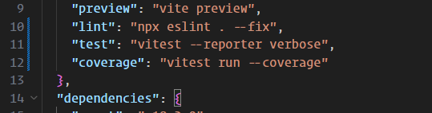
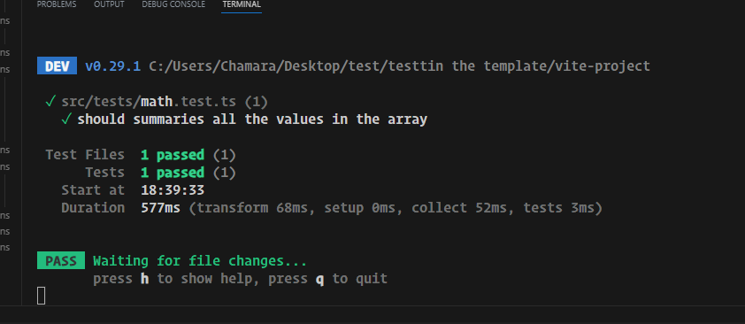
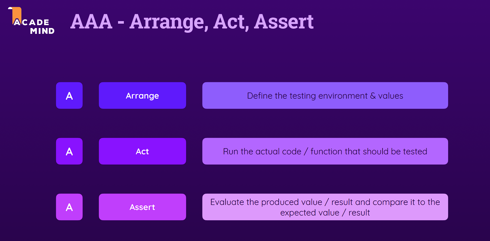
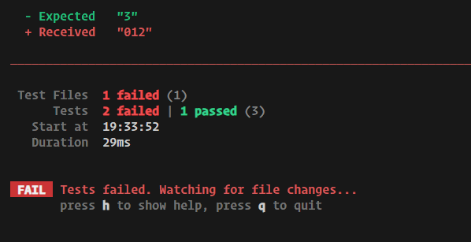
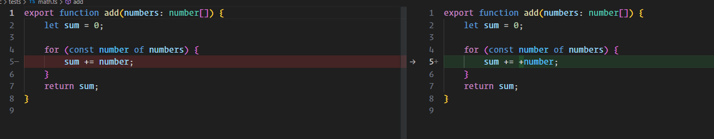
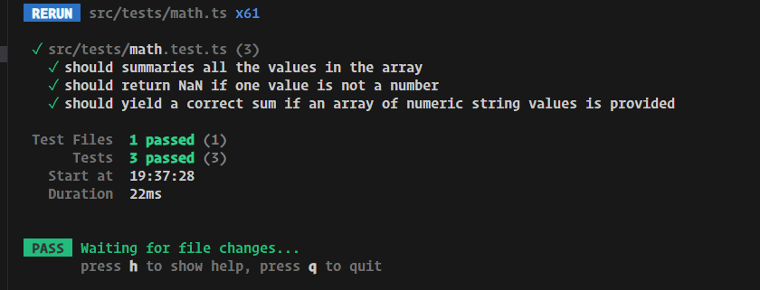

# Testing Basics

in your vite app install vitest

## let's add the vitest

```shell
npm install -D vitest
```

## let's add the command to run the vitest



## let's create a math file

```ts
export function add(numbers: number[]) {
 let sum = 0;

 for (const number of numbers) {
  sum += number;
 }
 return sum;
}

```

let's write the test cases for the math add function

```ts
import { it, expect } from 'vitest';
import { add } from './math';
// we can use test ot it
// they are both similar
// it('what your are testing and what is your expectation');
// this should be short and concise

it('should summaries all the values in the array', () => {
 const result = add([1, 2, 3]);
 expect(result).to.toBe(6);
});

```

and run the npm test command



## writing good tests the AAA pattern



let's add the method into our app

```ts
import { it, expect } from 'vitest';
import { add } from './math';
// we can use test ot it
// they are both similar
// it('what your are testing and what is your expectation');
// this should be short and concise

it('should summaries all the values in the array', () => {
 // Arrange
 const numbers = [1, 2, 3];
 const expectedResult = numbers.reduce((previousValue, currentValue) => {
  return previousValue + currentValue;
 }, 0);
 // Act
 const result = add(numbers);
 // Assert
 expect(result).to.toBe(expectedResult);
});
```

## Defining Behaviors & Fixing Errors In Your Code

let's add more tests to our add function

```ts
it('should return NaN if one value is not a number', () => {
 const inputs = [1, 2, 'not a number'];

 const result = add(inputs);

 expect(result).toBeNaN();
});

it('should yield a correct sum if an array of numeric string values is provided', () => {
 const inputs = ['1', '2'];
 const expectedResult = inputs.reduce((previousValue, currentValue) => {
  return +previousValue + +currentValue;
 }, 0);

 const result = add(inputs);

 expect(result).toBe(expectedResult);
});

```

now we can see our method doesn't work the way we want.



so let's fix our code



now our test are passing


