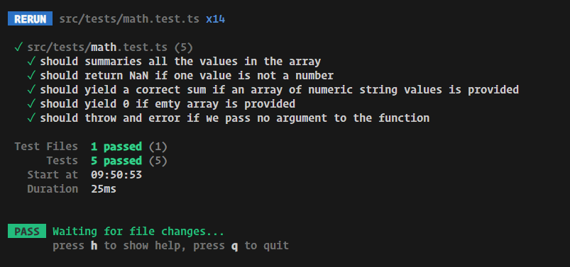
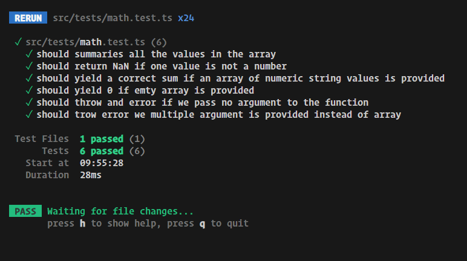

# Testing Basics

in your vite app install vitest

## let's add the vitest

```shell
npm install -D vitest
```

## let's add the command to run the vitest


## let's create a math file

```ts
export function add(numbers: number[]) {
 let sum = 0;

 for (const number of numbers) {
  sum += number;
 }
 return sum;
}

```




