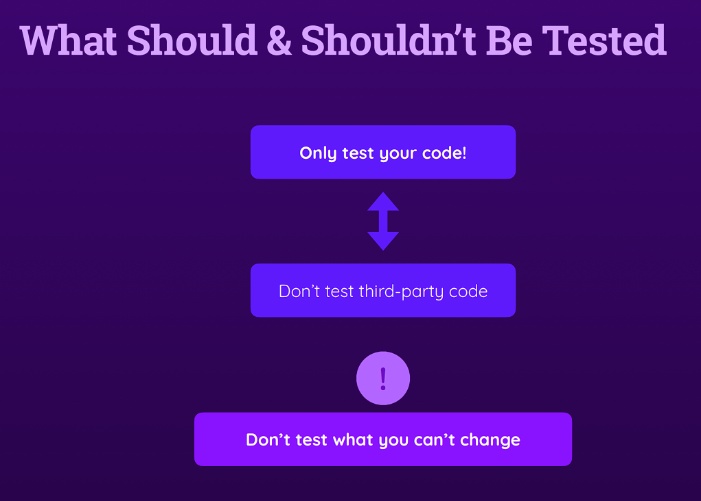
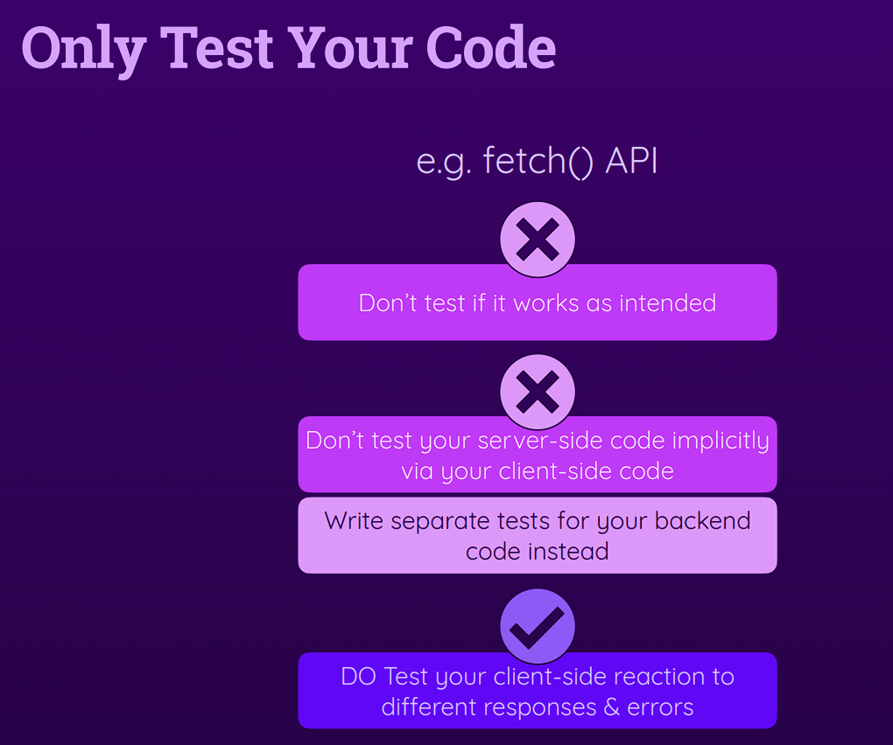

# Writing Good Tests

## 1. Module Introduction

## 2. What To Test & Not To Test

## 3. Writing Good Tests - An Overview & Summary

## 4. Only Test One Thing

## 5. Splitting Functions For Easier Testing & Better Code

## 6. Refactoring Code

## 7. Formulating Different Expectations

## 9. Module Summary
