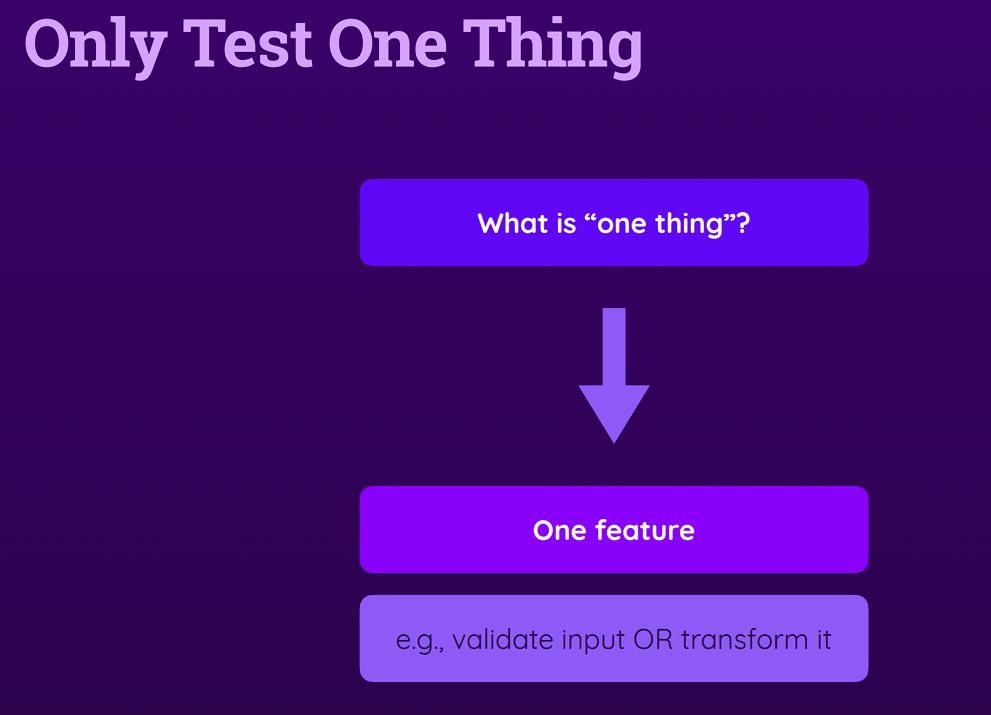

# Writing Good Tests

## 1. Module Introduction

## 2. What To Test & Not To Test


## 3. Writing Good Tests - An Overview & Summary


## 4. Only Test One Thing



## 5. Splitting Functions For Easier Testing & Better Code

let's create the util functions

```ts
export interface FormStateI {
 nim1?: number;
 num2?: number;
}

export const createStateObject = (
 state: FormStateI | undefined,
 id: string,
 value: number
) => {
 return {
  ...state,
  [id]: value,
 };
};

export const formatNumbers = (formState: FormStateI): [number, number] => {
 return Object.values(formState) as [number, number];
};
```

and create a form component

```tsx
import { FC, useState } from 'react';
import { add } from '../../util/math';
import { transformToNumber } from '../../util/numbers';
import { validateNumber, validateStringNotEmpty } from '../../util/validation';
import { createStateObject, formatNumbers, FormStateI } from '../../util/util';
import './Form.styles.css';

const Form: FC = () => {
 const [formState, setFormState] = useState<FormStateI>();
 const [formError, setFormError] = useState<string>();
 const [result, setResult] = useState<number>();
 const handleSubmit = (e: React.FormEvent<HTMLFormElement>) => {
  e.preventDefault();
  if (formState) {
   const input = formatNumbers(formState);
   const result = add(input);
   setResult(result);
  }
 };
 const handleChange = (e: React.ChangeEvent<HTMLInputElement>) => {
  const { value, id } = e.target;
  try {
   validateStringNotEmpty(value);
   validateNumber(+value);
   setFormError('');
  } catch (error: InstanceType<Error>) {
   setFormError(error.message);
  }
  const numberValue = transformToNumber(value);
  if (typeof numberValue === 'number') {
   const newState = createStateObject(formState, id, numberValue);
   setFormState(newState);
  }
 };

 const handleDisabled = () => {
  if (!formState) return true;
  if (formError) return true;
  if (Object.keys(formState).length === 2) {
   for (const item of Object.values(formState)) {
    if (!Number.isNaN(item)) {
     return false;
    } else {
     return true;
    }
   }
  }
  return true;
 };
 return (
  <>
   <form onSubmit={handleSubmit} className="form">
    <div className="form-element">
     <label htmlFor="num1">First Number</label>
     <input onChange={handleChange} id="num1" name="num1" type="numeric" />
    </div>
    <div className="form-element">
     <label htmlFor="num2">Second Number</label>
     <input onChange={handleChange} id="num2" name="num2" type="numeric" />
    </div>
    <p
     style={{
      color: 'red',
     }}>
     {formError}
    </p>
    <button type="submit" disabled={handleDisabled()}>
     Calculate
    </button>
   </form>
   <div>{result}</div>
  </>
 );
};

export default Form;

```

## 6. Refactoring Code

```ts
import { it, describe, expect } from 'vitest';
import { createStateObject, formatNumbers, FormStateI } from '../util/util';

describe('createStateObject()', () => {
 it('should yield a object when pass correct arguments', () => {
  const arg1 = {};
  const arg2 = 'num1';
  const arg3 = 12;

  const expectedResult = {
   ...arg1,
   [arg2]: arg3,
  };

  expect(createStateObject(arg1, arg2, arg3)).toStrictEqual(expectedResult);
 });

 it('should yield a object when the first argument is undefined', () => {
  const arg1: FormStateI | undefined = undefined;
  const arg2 = 'num1';
  const arg3 = 12;

  const expectedResult = {
   [arg2]: arg3,
  };

  expect(createStateObject(arg1, arg2, arg3)).toStrictEqual(expectedResult);
 });
});


describe('formatNumbers()', () => {
 it('should yield a object when pass correct arguments', () => {
  const arg1 = {
   num1: 1,
   num2: 2,
  };

  const expectedResult = [1, 2];

  expect(formatNumbers(arg1)).toStrictEqual(expectedResult);
 });

 it('should yield a object when the first argument is undefined', () => {
  const arg1 = {};

  expect(formatNumbers(arg1)).toStrictEqual([]);
 });
});
```


## 7. Formulating Different Expectations
